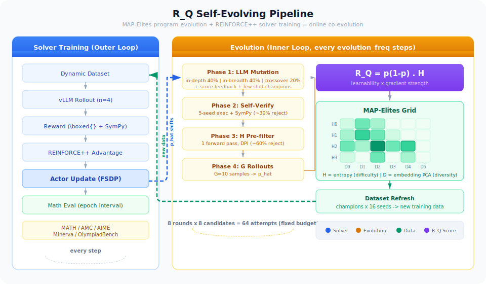

# R_Q Self-Evolving Problem Generation

> MAP-Elites로 **수학 문제 생성 프로그램**을 진화시키고, 진화된 문제로 동일 모델을 REINFORCE++ 학습하는 Self-Evolving 프레임워크.
> Fitness = `R_Q = p(1-p) · H`.

<p align="center">
  
</p>

---

## TL;DR

| 질문 | 답 |
|------|----|
| 무엇을 진화시키나? | **문제 텍스트가 아니라 `generate(seed) -> (problem, answer)` 형태의 Python 함수** |
| 진화 단위 | [ProblemProgram](rq_questioner/program.py) — 소스코드 + 실행 결과 + 점수 |
| 적합도 | `R_Q = p(1-p) · H` — [rq_score.py:compute_rq](rq_questioner/rq_score.py) |
| 다양성 보존 | [MAPElitesGrid](rq_questioner/map_elites.py) — H축(난이도) × D축(임베딩 클러스터) |
| 부모 선택 | ε-greedy + rank-UCB — [map_elites.py](rq_questioner/map_elites.py) |
| 추론 백엔드 | vLLM / **Ollama** / Mock — 셋 모두 동일 인터페이스 |
| 최종 목표 | 진화된 문제로 Solver를 REINFORCE++ 학습 ([run_verl.py](run_verl.py)) |

---

## Glossary (용어 → 정의)

| 용어 | 정의 | 위치 |
|------|------|------|
| **ProblemProgram** | 문제 생성 함수를 감싼 진화 단위. `source_code` + 실행 캐시 + `p_hat/h_score/rq_score` 보유 | [program.py](rq_questioner/program.py) |
| **ProblemInstance** | `ProblemProgram.execute(seed)` 의 반환값. `(problem: str, answer: str)` | [program.py](rq_questioner/program.py) |
| **p_hat** | Solver가 rollout G번 중 맞춘 비율 (문제의 난이도, 0~1) | [rq_score.py:estimate_pass_rate](rq_questioner/rq_score.py) |
| **H (entropy)** | Solver 출력 분포의 불확실성. vLLM=token logprobs, Ollama=semantic entropy | [rq_score.py](rq_questioner/rq_score.py) |
| **R_Q** | `p_hat · (1 - p_hat) · H` — learnability × gradient-strength proxy | [rq_score.py:compute_rq](rq_questioner/rq_score.py) |
| **niche** | `(H_bin, D_bin)` 좌표의 격자 cell. cell당 champion 1개 유지 | [map_elites.py:NicheInfo](rq_questioner/map_elites.py) |
| **D축** | 문제 텍스트의 sentence-embedding을 PCA로 떨어뜨린 다양성 축 | [map_elites.py:fit_diversity_axis](rq_questioner/map_elites.py) |
| **champion** | 해당 niche 안에서 R_Q 최고인 `ProblemProgram` | [map_elites.py:try_insert](rq_questioner/map_elites.py) |
| **in-depth / in-breadth / crossover** | 3가지 mutation 연산자 | [prompts/mutation.py](prompts/mutation.py) |

---

## Project Layout

```
evo-sample/
├── run_verl.py                        # Entry: veRL + evolution 통합 학습
├── reward_fn.py                       # Solver reward (boxed 추출 + SymPy 비교)
├── requirements.txt
│
├── configs/
│   ├── rq_config.yaml                 # RQ-Evolve 학습 설정
│   └── grpo_config.yaml               # baseline GRPO 설정
│
├── prompts/                           # LLM 프롬프트 (단일 소스)
│   ├── __init__.py                    # re-export
│   ├── mutation.py                    # MUTATE_DEPTH / MUTATE_BREADTH / MUTATE_CROSSOVER
│   └── solver.py                      # SOLVER_SYSTEM_PROMPT / SOLVER_COMPLETION_PROMPT
│
├── seed_programs/                     # 초기 generate(seed) 프로그램 17개
│   ├── 01_equation_modeling.py ... 17_inequalities.py
│
├── rq_questioner/                     # 핵심 모듈
│   ├── program.py                     # ProblemProgram, ProblemInstance
│   ├── map_elites.py                  # MAPElitesGrid (ε-greedy + rank-UCB)
│   ├── rq_score.py                    # R_Q = p(1-p)·H, filters
│   ├── verifier.py                    # SymPy 기반 정답 검증
│   ├── verl_dataset.py                # MapElitesDynamicDataset (thread-safe online update)
│   └── verl_trainer.py                # RQEvolveTrainer (RayPPOTrainer + evolution hook)
│
├── verl/                              # 내장 veRL 0.3.1 (FSDP + vLLM hybrid engine)
│
├── scripts/                           # 실행 스크립트 (entry points)
│   ├── test_local.py                  # ① CPU 검증 (GPU 불필요)
│   ├── test_feasibility.py            # ② GPU + vLLM feasibility
│   ├── test_feasibility_ollama.py     # ③ Ollama feasibility (로컬 M-series 가능)
│   ├── evaluate.py                    # 벤치마크 평가
│   ├── run_eval.sh / run_train.sh
│   └── visualize_evolution.py
│
├── evaluation/                        # 벤치마크 로더 (GSM8K/MATH-500/AIME)
├── docs/
│   ├── architecture.svg
│   └── evolution_pipeline.md
└── feasibility_out/                   # 실행 결과 (대시보드/JSON/CSV)
```

---

## Entry Points (실행 가능한 스크립트)

| # | 스크립트 | 하드웨어 | 역할 | 대표 명령 |
|---|---------|----------|------|-----------|
| ① | [scripts/test_local.py](scripts/test_local.py) | CPU | seed 실행/R_Q/grid 동작 dry-run | `python scripts/test_local.py` |
| ② | [scripts/test_feasibility.py](scripts/test_feasibility.py) | GPU + vLLM | 실제 LLM로 진화 전체 검증 | `python scripts/test_feasibility.py --vllm_model Qwen/Qwen3-8B-Base --tp 4` |
| ③ | [scripts/test_feasibility_ollama.py](scripts/test_feasibility_ollama.py) | CPU/Mac | 로컬 Ollama 모델로 진화 검증 | `python scripts/test_feasibility_ollama.py --ollama_model qwen3:4b-instruct` |
| ④ | [run_verl.py](run_verl.py) | Multi-GPU | 진화 + REINFORCE++ online training | `python run_verl.py --config configs/rq_config.yaml` |

**선택 기준**: 알고리즘만 확인 → ①, GPU 클러스터 있음 → ②, 맥북/로컬에서 LLM 돌리고 싶음 → ③, 전체 학습 → ④.

---

## Pipeline (동작 과정)

### 전체 흐름 (실행 시 시간 축)

```
[시작]
  │
  ├─ Phase 0. 초기화
  │    ├─ seed_programs/*.py 17개 로드 → ProblemProgram 생성
  │    ├─ 각 seed 를 execute(seed=0..4) 해서 샘플 문제 뽑음
  │    ├─ sentence-embedding PCA로 D축 fitting
  │    └─ 각 seed 에 대해 H, p_hat 측정 → R_Q → MAPElitesGrid.try_insert()
  │
  └─ Phase 1~N. Evolution Loop (--n_evo step)
       │
       └─ 매 step, --max_rounds 라운드 반복:
            │
            ├─ (A) 부모 선택 — grid.sample_parent() / sample_two_parents()
            │       └─ ε-greedy + rank-UCB
            │
            ├─ (B) Mutation (LLM 호출, --candidates 개 배치)
            │       ├─ crossover   — MUTATE_CROSSOVER
            │       ├─ in-depth    — MUTATE_DEPTH (난이도↑)
            │       └─ in-breadth  — MUTATE_BREADTH (도메인 전환)
            │
            ├─ (C) 자가 검증 — _verify_program()
            │       ├─ 5 seed 로 실행
            │       └─ SymPy 로 answer 파싱 성공해야 통과
            │
            ├─ (D) Rollout (LLM 호출, 배치)
            │       └─ 각 문제당 G = --n_rollouts 번 생성 → p_hat
            │
            ├─ (E) Entropy (LLM 호출, 배치)
            │       ├─ vLLM  : top-K logprobs 기반 Shannon H
            │       └─ Ollama: N 샘플의 boxed-answer 분포로 semantic H
            │
            ├─ (F) 필터
            │       ├─ h_prefilter(H ≥ --h_threshold)
            │       └─ p_hat_filter(0 < p_hat < 1)
            │
            └─ (G) R_Q 계산 + grid 갱신
                    ├─ compute_rq_full(flags, H)
                    └─ grid.try_insert() — 같은 niche 의 기존 champion 과 R_Q 비교 → 교체
       │
       └─ (매 step 끝) dashboard_live*.html 덮어쓰기
  
[종료]
  └─ Phase 2. 결과 저장
       history_*.json / champions_*.json / grid_*.csv / rollout_logs_*.json / dashboard_*.html
```

### Runner 추상화 (동일 인터페이스)

`scripts/test_feasibility*.py` 의 `evolution_step()` 은 runner 객체의 아래 메서드만 호출하므로, vLLM/Ollama/Mock 어느 백엔드든 교체 가능:

```python
runner.batch_mutate(tasks, grid)           -> list[str | None]
runner.batch_rollout(instances, n_rollouts) -> list[tuple[flags, logs]]
runner.batch_entropy(instances)             -> list[float | None]
```

| Runner | 위치 | Entropy 방식 |
|--------|------|--------------|
| `VLLMRunner` | [test_feasibility.py](scripts/test_feasibility.py) | top-K token logprobs (Shannon 근사) |
| `OllamaRunner` | [test_feasibility_ollama.py](scripts/test_feasibility_ollama.py) | N샘플 답 분포의 **의미론적 엔트로피** |
| Mock | `_mock_rollout / _mock_entropy` | 랜덤/정규분포 |

---

## Module Contracts

각 모듈의 책임/입출력을 요약. 자세한 시그니처는 코드 참조.

### [rq_questioner/program.py](rq_questioner/program.py)
- `ProblemProgram(source_code, parent_id, generation, metadata)` — 진화 단위
  - `execute(seed, timeout) -> ProblemInstance | None`
  - 속성: `p_hat`, `h_score`, `rq_score`, `fitness`, `niche_h`, `niche_div`, `program_id`
- `ProblemInstance(problem: str, answer: str)`

### [rq_questioner/map_elites.py](rq_questioner/map_elites.py)
- `MAPElitesGrid(n_h_bins, n_div_bins, h_range, ucb_c, epsilon)`
  - `fit_diversity_axis(problems)` — sentence-embedding PCA로 D축 학습
  - `sample_parent() / sample_two_parents()` — ε-greedy + rank-UCB
  - `try_insert(program, h_value, problem_text, rq_score) -> bool` — 동일 niche champion과 비교 후 교체
  - `stats() -> {coverage, num_champions, mean_rq, max_rq, hard_champions, ...}`
  - `get_all_champions() -> list[ProblemProgram]`

### [rq_questioner/rq_score.py](rq_questioner/rq_score.py)
- `compute_rq(p_hat, h) -> RQResult`
- `compute_rq_full(flags: list[bool], h_bar: float) -> RQResult`
- `estimate_pass_rate(flags) -> float`
- `h_prefilter(h, threshold) -> bool`
- `p_hat_filter(p_hat) -> bool` (0 < p < 1)

### [rq_questioner/verifier.py](rq_questioner/verifier.py)
- `verify_problem(problem, answer, method="sympy") -> bool`

### [rq_questioner/verl_trainer.py](rq_questioner/verl_trainer.py)
- `RQEvolveTrainer(RayPPOTrainer)` — `fit()` 루프 안에 evolution hook 삽입
- 유틸: `_verify_program`, `_extract_boxed`, `_sympy_equal`, `_answers_match`

### [rq_questioner/verl_dataset.py](rq_questioner/verl_dataset.py)
- `MapElitesDynamicDataset(Dataset)` — evolution이 grid를 갱신하면 dataloader가 다음 step에서 최신 champion을 쓰도록 thread-safe하게 재구성

### [prompts/](prompts/)
- 템플릿: `MUTATE_DEPTH`, `MUTATE_BREADTH`, `MUTATE_CROSSOVER`, `SCORE_FEEDBACK`, `SOLVER_COMPLETION_PROMPT`
- 헬퍼: `score_diagnosis`, `build_score_feedback`, `build_few_shot_examples`, `build_execution_feedback`

---

## Quick Start

### 설치

```bash
pip install -r requirements.txt
# Ollama 경로를 쓸 경우 추가:
pip install ollama python-dotenv
```

### 시나리오 A — CPU만 있을 때 (로직 검증)

```bash
python scripts/test_local.py
```
seed 실행, R_Q 계산, grid 동작, pipeline dry-run 등 5 테스트 통과하면 OK.

### 시나리오 B — GPU + vLLM (실측 feasibility)

```bash
python scripts/test_feasibility.py \
    --vllm_model Qwen/Qwen3-8B-Base \
    --tp 4 --n_evo 50 \
    --n_h_bins 10 --n_div_bins 10
```

### 시나리오 C — 로컬 Ollama (Mac/저사양 GPU)

**사전 준비**
```bash
# 1) 서버 실행 (Ollama 앱이 돌고 있으면 생략)
ollama serve

# 2) 모델 pull (한 번만)
ollama pull qwen3:4b-instruct

# 3) 서버 확인
curl http://localhost:11434/api/tags
```

**실행**
```bash
python scripts/test_feasibility_ollama.py \
    --ollama_model qwen3:4b-instruct \
    --n_evo 5 --candidates 4 \
    --max_parallel 4
```

> Ollama의 semantic entropy는 vLLM token-logprob 기반보다 스케일이 작아 기본 `--h_range [0, 2.5]`, `--h_threshold 0.05` 로 잡혀 있다. 필요 시 조정.

### 시나리오 D — 전체 학습 (veRL)

```bash
python run_verl.py --config configs/rq_config.yaml
```

---

## Configuration Reference

### 공통 (feasibility 스크립트)

| 인자 | 기본 (vLLM) | 기본 (Ollama) | 설명 |
|------|-------------|----------------|------|
| `--seed_dir` | `./seed_programs` | 동일 | seed `.py` 디렉터리 |
| `--n_evo` | 10 | 10 | evolution step 수 (outer loop) |
| `--candidates` | 8 | 8 | 라운드당 mutation 후보 수 |
| `--max_rounds` | 8 | 8 | step당 라운드 수 (fixed budget) |
| `--n_rollouts` | 10 | 10 | 문제당 solver rollout (G) |
| `--n_h_bins` | 6 | 6 | H축 bin 수 |
| `--n_div_bins` | 6 | 6 | D축 bin 수 |
| `--h_range` | `0.0 5.0` | `0.0 2.5` | H축 범위 |
| `--h_threshold` | 0.1 | 0.05 | H pre-filter 임계값 |
| `--crossover_ratio` | 0.2 | 0.2 | crossover 연산자 비율 |
| `--in_depth_ratio` | 0.5 | 0.5 | in-depth 비율 (나머지=in-breadth) |
| `--ucb_c` | 1.0 | 1.0 | rank-UCB exploration 계수 |
| `--epsilon` | 0.3 | 0.3 | ε-greedy 확률 |
| `--temperature` | 0.7 | 0.7 | generation temperature |
| `--out_dir` | `./feasibility_out` | 동일 | 결과 저장 경로 |

### vLLM 전용 — [test_feasibility.py](scripts/test_feasibility.py)

| 인자 | 기본 | 설명 |
|------|------|------|
| `--vllm_model` | — | HF 모델 경로/이름 (미지정 시 Mock) |
| `--tp` | 1 | tensor parallel GPU 수 |
| `--gpu_mem` | 0.85 | `gpu_memory_utilization` |
| `--max_tokens` | 10240 | rollout 최대 토큰 |
| `--model / --base_url / --api_key` | — | OpenAI 호환 API (mutation만 실제, 나머지 mock) |

### Ollama 전용 — [test_feasibility_ollama.py](scripts/test_feasibility_ollama.py)

| 인자 | 기본 | 설명 |
|------|------|------|
| `--ollama_model` | **필수** | 로컬 Ollama 모델명 (예: `qwen3:4b-instruct`) |
| `--ollama_host` | `http://localhost:11434` | Ollama 서버 URL |
| `--max_tokens` | 4096 | generation `num_predict` |
| `--n_entropy_samples` | 8 | semantic entropy 측정용 샘플 수 |
| `--max_parallel` | 4 | 스레드 풀 동시 요청 수 |

---

## Outputs

`--out_dir` (기본 `./feasibility_out/`) 아래에 저장:

| 파일 | 내용 |
|------|------|
| `dashboard_live*.html` | 매 step 갱신되는 실시간 대시보드 (grid slider + champion 예시) |
| `dashboard_{run_id}.html` | 최종 대시보드 |
| `history_{run_id}.json` | step별 `coverage / mean_rq / max_rq / inserted / attempted` |
| `champions_{run_id}.json` | 모든 champion 의 `source_code` + 5 seed 예시 문제 |
| `grid_{run_id}.csv` | `D_bin × H_bin` R_Q heatmap |
| `rollout_logs_{run_id}.json` | candidate별 rollout 응답 원문 + 정답 비교 (디버깅용) |

---

## Algorithm (외부 학습 루프 — veRL 통합 시)

```
RayPPOTrainer.fit():
  매 step:
    dynamic_dataset → rollout → reward → REINFORCE++ update

  evolution_freq 마다 (기본: 전체 step의 10%):
    ┌── Inner loop: Fixed-Budget Evolution ──────────────┐
    │  위의 Phase 1 (A)~(G) 를 max_rounds 회 반복         │
    └─────────────────────────────────────────────────────┘
    _refresh_dataset() → dataloader 재구성
    → 다음 step 부터 진화된 문제로 학습

  val_freq 마다: solver accuracy 평가
```

---

## Design Decisions

| 선택 | 근거 | 참고 |
|------|------|------|
| 문제 **프로그램** 진화 (텍스트 X) | 역방향 구성 → 정답 보장 | FunSearch (2023) |
| `R_Q = p(1-p)·H` | learnability × gradient strength 근사 | 연구 제안서 S2.5 |
| MAP-Elites grid | niche 독립 진화 → 다양성 붕괴 방지 | Mouret & Clune (2015) |
| D축 = embedding PCA | Surface Diversity Illusion 방지 | 연구 제안서 S3.3 |
| ε-greedy + rank-UCB | exploit 편향 제거 | Monte Carlo Elites (2023) |
| Fixed budget (조기종료 X) | 안정적 탐색 | FunSearch |
| Solver = REINFORCE++ | KL-regularized RL | veRL |
| H pre-filter → rollout | 계층적 필터링 비용 절감 | 연구 제안서 S4.2 |

---

## Feasibility Test Results (reference)

Qwen3-8B-Base, 10 steps, 6×6 grid, vLLM backend:

| Step | Coverage | Champions | Inserted | mean_rq | max_rq |
|-----:|---------:|----------:|---------:|--------:|-------:|
| 1    | 31%      | 11        | 13       | 0.244   | 0.665  |
| 4    | 42%      | 15        |  8       | 0.323   | 0.867  |
| 9    | 50%      | 18        |  3       | 0.373   | 0.867  |

- Coverage 31% → 50%, mean_rq 83% 향상
- H0~H4, D0~D4 전 영역에 champion 분산

---

## Known Issues / Notes

- Ollama 경로의 entropy 는 semantic entropy 이므로 vLLM 과 **숫자 단위가 다르다**. niche 경계가 달라져 직접 비교 불가.
- `verl/` 는 내장된 veRL 0.3.1 스냅샷 (FSDP + vLLM hybrid engine).
- `prompts/mutation.py` 는 `MUTATION_METHOD_RULE` + `SINGLE_ANSWER_RULE` 두 규칙 블록을 MUTATE_* 템플릿에 주입한다.

---

## References

- [FunSearch](https://www.nature.com/articles/s41586-023-06924-6) — Romera-Paredes et al., 2023
- [MAP-Elites](https://arxiv.org/abs/1504.04909) — Mouret & Clune, 2015
- [ELM](https://arxiv.org/abs/2206.08896) — Lehman et al., 2022
- [R-Zero](https://arxiv.org/abs/2502.04113) — Yuan et al., 2025
- [Monte Carlo Elites](https://arxiv.org/abs/2104.08781) — Flageat et al., 2023
